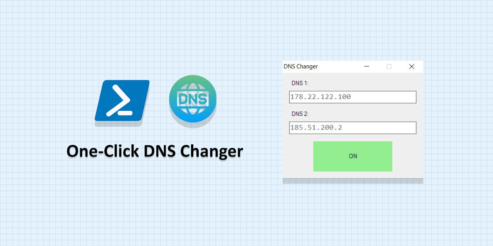

# One-Click DNS Changer

This is an easy-to-use portable program for setting custom DNS in Windows. It has been written in PowerShell.

Tested on `Windows 10` with `PowerShell 5.1`.

## Author

**Rabist** - view on [LinkedIn](https://www.linkedin.com/in/rabist)

## License

Licensed under [MIT](LICENSE).
